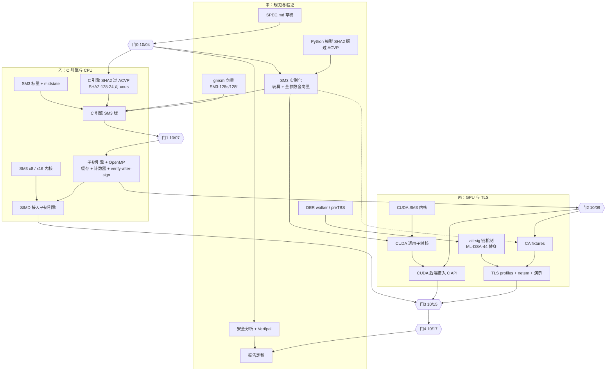

# A1-5 分工实施计划 v2：SLH-DSA-SM3 × SP 800-230 128-24 × 三人并行

> 题目：面向后量子环境的数字签名算法优化设计实现（A1-5，软件设计）  
> 复赛提交窗口：2026-10-19 09:00 — 10-22 18:00。内部 10-18 封包，计划 10-19/10-20 提交，不压最后一天  
> 版本：v2.0（2026-10-03），整体取代 v1.0；配套文件：`A1-5_路线复审与国一冲刺方案.md`  
> 团队：3 人，下文称甲、乙、丙，开会时按各自擅长的方向对号入座即可

---

## 0 一页纸摘要

### 0.1 作品一句话

在 FIPS 205 框架内用国密 SM3 实例化 SLH-DSA，参数覆盖标准的 128s、128f，以及 NIST SP 800-230 草案新增的 128-24 有限次数参数集。

围绕 128-24 做三件事。第一，用"可调缓存 + 单个签名内部的多核/SIMD/GPU 并行"，把 128-24 的签名从单核约 5 分钟（估算）压到亚秒级。第二，用五方交叉验证保证实现正确。第三，把它接进团队已有的 hybrid-tls13 v9 协议栈，作为 CA 证书链上的后量子替代签名（alt-signature），正好补上 v9 自己在 `docs/SECURITY.md` 第 6 条承认的缺口："链上每个签名仍是经典签名"。

### 0.2 为什么这样讲故事

128-24 是一笔交换：

| | 相对 128s |
|---|---|
| 签名大小 | 3,856 B，是 128s 的 49% |
| 验签代价 | 276 次哈希调用，是 128s 的 1/7.6 |
| 签名代价 | 1.45×10^9 次调用，是 128s 的 664 倍 |
| 签名次数上限 | 每把密钥 2^24 次 |

这笔交换恰好适合 CA：CA 签得少，可以离线慢慢签，而每次 TLS 握手、每个客户端都要验链。所以作品的两条主线其实是一回事：算法侧的优化负责把"签名慢"这个代价打下来；协议侧的集成负责在真实握手里量出"小签名 + 快验签"到底值多少，包括 initcwnd 能否装下、多花几个 RTT、链验证要几毫秒。

评委看到的是一个闭环：选参数 → 发现代价 → 用工程手段消掉代价 → 在应用里兑现收益。

### 0.3 关键数字

下表是脚本按 FIPS 205 算法逐项计数的结果，不是实测；单核时间用本机实测的 SM3 速度（约 215 ns/压缩）折算。

| 指标 | SLH-DSA-SM3-128s | SLH-DSA-SM3-128-24 | 说明 |
|---|---|---|---|
| 公钥 / 私钥 | 32 B / 64 B | 32 B / 64 B | |
| 签名 | 7,856 B | **3,856 B** | 由参数公式确定：16 + 2,400 + 1,440 |
| 每把密钥签名上限 | 2^64 | 2^24 | |
| 密钥生成哈希调用 | 287,743 | 1,149,239,295 | |
| 签名哈希调用（无缓存） | 2,185,948 | 1,451,229,053 | 约 664 倍 |
| 签名哈希调用（32 KiB 缓存，t=12） | — | 约 3.031×10^8 | 只比全缓存多 0.4% |
| 签名哈希调用（全缓存 128 MiB） | — | 301,990,053 | 约 138 倍；其中 FORS 的 3.02×10^8 是下限，任何缓存都去不掉 |
| 验签哈希调用（期望值） | 2,090 | **276** | 少 7.6 倍 |
| 单核标量签名（估算） | 约 0.48 s | 无缓存约 327 s，有缓存约 65 s | 这是"要优化什么"的出发点 |
| 伪造概率界 | 133.7 bit（签 2^64 次） | 128.6 bit（签 2^24 次） | 超用到 2^25 / 2^26 / 2^28 次时分别为 124.0 / 118.9 / 107.7 bit |

### 0.4 三人分工

| 角色 | 负责 | 关键交付 | 对应报告章节 |
|---|---|---|---|
| **甲：规范与验证** | SPEC、Python 参考模型与全部向量、交叉验证矩阵、preTBS 纯函数模块、安全分析、Verifpal 建模；担任报告主笔，管提交清单 | SPEC.md（门0）、金向量（门1 前）、R1/R7/R8、报告全文 | 设计方案、安全分析、测试方案 |
| **乙：C 引擎与 CPU 优化** | 改造 slhdsa-c：SM3 实例化、三组参数、子树引擎、计数器、verify-after-sign、缓存；OpenMP、AVX2 x8 / AVX-512 x16；API、.so/.dll、CLI；CPU 基准与 Hygon 平台（NEON 可砍） | libslhdsa_sm3（门1、门2）、R2–R5 | 实现原理、技术指标 |
| **丙：GPU 与 TLS** | CUDA：SM3 核、通用子树核、CUDA 后端。v9 集成：`SlhDsaSm3` 后端与 ctypes 封装、alt-sig 链的签发与验证、fixtures、profiles P0–P5、netem 实验、演示 | GPU 后端（输出与 CPU 一致）、R3 的 GPU 列、R6、演示录屏 | 功能说明、应用测试 |

### 0.5 五个关口

| 关口 | 截止 | 一句话条件 |
|---|---|---|
| 门0 | 10/04 24:00 | SPEC、C API、子树接口、向量与基准格式冻结 |
| 门1 | 10/07 24:00 | 引擎正确：交叉验证 (A)(B)(C)(D) 全部通过 |
| 门2 | 10/09 24:00 | API/ABI 冻结，.so/.dll 可用，TLS 从替身算法切到真库 |
| 门3 | 10/15 24:00 | 代码冻结 |
| 门4 | 10/17 24:00 | 全部数据来自冻结后的代码；10/18 封包，10/19–10/20 提交 |

两条硬规则没有例外：没过门1 的引擎，不出任何进报告的性能数字；CUDA 输出与 CPU 逐字节一致之前，GPU 数字不进报告。

---

## 1 相对 v1 的更正与变化

v1 有几处事实错误，也有按 4 人、全员同步推进来排的结构问题。下表逐条对应，方便已经读过 v1 的队友对照。

| # | v1 写法（位置） | 问题 | v2 处理 |
|---|---|---|---|
| 1 | 4 个角色 A–D（§二） | 实际只有 3 人 | 改为甲乙丙三角色，按依赖图并行（§3、§5） |
| 2 | 签名大小一栏写"[实测]"（§五） | 3,856 B 由参数公式算出，不需要也不能"实测" | 直接写 3,856 B：R 16 + FORS 6×25×16 = 2,400 + HT (22+68)×16 = 1,440。实测的是时间和调用次数 |
| 3 | "GPU 批量签名，512 个签名请求并行"（§一、§三 G4） | 128-24 单个签名就有 1.45×10^9 次调用，足以占满 GPU。有 2^24 上限的 CA 密钥也不会一次签 512 张；批量吞吐只会掩盖单次签名的延迟 | 改为单签名内部并行：FORS 的 6×2^24 个叶、XMSS 的 2^22 个叶切成子树任务。GPU 与 CPU 共用同一个子树接口 |
| 4 | 推荐 `github.com/sphincsplus/sphincsplus`（§三 G0） | 地址错误；该库参数在编译期固定，w=4、d=1 要改很多宏 | 主基线改用 slhdsa-c（运行时参数，已过 ACVP）。正确地址 github.com/sphincs/sphincsplus 只作 x8 AVX2 结构参考 |
| 5 | SM3 计数器模式 XOF、`sm3_xof.c`（§三 G1、§四） | 不需要 XOF：FIPS 205 的 SHA2 实例化本来只用 MGF1、HMAC 和截断 | 按 FIPS 205 §11.2.1 一一对应（见 §4.1）：H_msg = MGF1-SM3，PRF_msg = HMAC-SM3，其余为 Trunc_n(SM3(…))。与 gmsm 的 SLH-DSA-SM3 实例化一致，可以直接对向量 |
| 6 | "AVX2 4 条、AVX-512 8 条"，`sm3_4way.c`（§三 G2、§四） | SM3 是 32 位字运算：256 位寄存器放 8 路，512 位放 16 路 | AVX2 x8、AVX-512 x16、NEON x4；文件名为 `sm3_x8_avx2.c`、`sm3_x16_avx512.c` |
| 7 | GmSSL `src/sm3_avx.c`（§三 G2） | 未核实是否存在 | 多路实现参考 isa-l_crypto 的 sm3_mb（BSD-3，有 x8/x16）和 intel-ipsec-mb；GmSSL 只作标量参考 |
| 8 | CertificateVerify 用 128-24；fork OpenSSL 并注册 0xFE01（§三 G4） | 每次握手签一次 128-24 不现实（单核要几分钟）。0xFE01 在 v9 里已经是 `EXTENSION_PQ_KEY_SHARE`。fork OpenSSL 15 天做不完，也和已有的 v9 重复 | 128-24 只用在 CA 链的 alt-signature 上，直接集成进 v9；方案号用 0xFEA0–0xFEA2 |
| 9 | KAT"自洽验证"（§三 G1） | 自洽只说明签得出、验得过，不说明与标准一致 | 改为五方交叉验证矩阵（§7） |
| 10 | 每个数据点"100 次中位数"（§三 G2） | 128-24 无缓存标量签名一次约 5 分钟 | 无缓存签名 N=5，有缓存签名 N≥30，验签 N=10,000；报中位数和 IQR |
| 11 | 意见征集期"至 06-17"（§六） | 日期错误 | 截止日期为 2026-06-12 |
| 12 | G0→G5 全员同步推进 | 人等人，3 人时尤其浪费 | 只保留一条真正串行的主干，其余按依赖图并行（§3） |
| 13 | （路线文件与旧记忆）"128-24 比 128s 少 50–60% 调用" | 方向反了 | 签名调用多 664 倍，验签调用少 7.6 倍；路线文件已同步更正 |

---

## 2 v9 TLS 栈：已有什么、怎么复用

### 2.1 现状

`hybrid-tls13-review-package-v9` 是一个用 Python 实现的 hybrid TLS 1.3 研究栈（要求 3.11+，开发环境为 3.13.7 / Windows 11），已经做到第 9 轮评审。已有内容如下：

| 方面 | 已有内容 |
|---|---|
| 协议 | 线格式编解码；与 RFC 8448 向量逐字节对齐的密钥调度 |
| 密钥交换 | X25519 + ML-KEM / HQC 混合 |
| 认证 | 双签名 CertificateVerify：ECDSA-P256 + ML-DSA / Falcon / XMSS |
| 传输 | 记录层、传输层、用户态链路整形器 |
| 验证 | 393 个测试、6 个 Verifpal 模型、35 项检查的验收脚本 `tools/verify_all.ps1`、活性检查工具 `tools/audit_live_checks.py` |
| 数据 | `.bench-out/` 中的实测数据 |

默认配置（`tls/config.py::HybridTLSConfig`）为 x25519 + ML-KEM-768、ECDSA-P256 + Falcon-512、AES-128-GCM。

打开 `x509=True` 后，会生成一条真实的 root → intermediate → leaf 证书链。三张证书都是 ECDSA P-256，后量子公钥放在叶证书的私有扩展 `1.3.6.1.4.1.99999.1` 里。服务器只发 leaf 和 intermediate（`tls/handshake/server.py:220`）。root 不随握手发送，是客户端本地的信任锚：链顶若不是 root 本身（按完整 DER 比较），就用 root 的公钥验证链顶证书的签名（`tls/pki.py::verify_chain`）。

### 2.2 v9 的缺口就是我们的切入点

v9 的 `docs/SECURITY.md` 第 6 条写明："every signature in that chain is still classical"。

它的后果：一个能伪造 ECDSA 的量子敌手，可以自己签发一张叶证书，把自己的 Falcon/ML-DSA 公钥塞进去。这样一来，握手里那个后量子 CertificateVerify 就什么也证明不了，因为它验证的是敌手的公钥。

所以只有 CertificateVerify 是混合的还不够，CA 链也必须有后量子签名。

128-24 的特点恰好匹配这个位置：

| CA 链的需求 | 128-24 的特点 |
|---|---|
| CA 签发次数少，2^24 张绰绰有余 | 每把密钥上限 2^24 次 |
| 可以离线签 | 签名慢，但有缓存和并行 |
| 每个客户端每次握手都要验两张证书 | 验签 276 次调用，非常快 |
| 证书要随握手发送 | 签名只有 3,856 B，比 128s 小一半，这决定了首轮能否装进 initcwnd |

TLS 部分因此不再是一个"演示"，而是一个有安全意义、能量化收益的应用场景。

### 2.3 复用与改动清单

| 模块（文件 / 符号） | v9 现状 | 本作品的用法 | 改动量 |
|---|---|---|---|
| `tls/pq/signature.py`：`_SCHEME_IDS`、`MlDsa`、`Falcon`、`Xmss`、`get_pq_signer`、`available_pq_signers` | PQ 签名后端的注册与分发 | 新增 `SlhDsaSm3` 类：用 ctypes 调用 libslhdsa_sm3；库不存在时退回甲的纯 Python 模型做验签。名字为 slh-dsa-sm3-128s / 128f / 128-24，方案号 0xFEA0 / 0xFEA1 / 0xFEA2 | 小，约 150 行 |
| `tls/pq/backends.py::PqSigner` | 后端协议（name、scheme_id、keygen、sign、verify 等） | 不改，按协议实现 | 0 |
| `tls/pki.py`：`_issue`、`build_test_chain`、`verify_chain`、`_verify_signature`、`_reject_unknown_critical_extensions`、`pq_extension_from_leaf` | 真实 X.509 链，全部经典签名 | 新增 alt-sig 签发与验证（扩展 2.5.29.72/73/74）和 preTBS 计算。三个新扩展均为非关键，不影响 `_reject_unknown_critical_extensions` | 中，约 250 行加测试 |
| `tls/credentials.py`：`CertificateAuthority`、`ServerCredentials._build_chain`、`pq_signatures_remaining` | 每次构造都重新生成密钥和整条链 | 增加 fixture 加载路径，测试中绝不现场做 128-24 签名。"剩余签名次数"的含义对 SLH-DSA 改为"CA 还能签发多少张" | 小 |
| `tls/config.py::HybridTLSConfig` | `pq_signer` 默认 falcon-512，`x509` 开关 | 新增 `alt_chain`（None / slh-dsa-sm3-128-24 / slh-dsa-sm3-128s / ml-dsa-44 / falcon-512）和客户端策略 `require_alt_chain` | 小 |
| `tls/handshake/connection.py:149-151` | 打印 "one-time signatures left:" | 改措辞，区分 XMSS 的一次性叶和 SLH-DSA 的次数上限 | 极小 |
| `tls/handshake/server.py:220` | 发送 `chain_der`（leaf, intermediate） | 不改，只是链变大了 | 0 |
| `bench/measure_handshake.py`、`measure_tcp.py`、`measure_shaped.py`、`_io.py` | 字节、阶段耗时、回环 TCP、整形链路 | 增加 P0–P5 profiles 与逐扩展字节分解；新增 `bench/netem_veth.sh`（Linux） | 中 |
| `verification/verifpal/generate_models.py`、`tools/verify_all.ps1` 中的 `$expected` | 6 个模型，结果码固定在脚本里 | 新增 2–3 个"量子敌手"模型（§8.6） | 小 |
| `tools/audit_live_checks.py::INTERFACE_METHODS` | 活性检查：以 check/verify/require/reject/validate/enforce 开头的函数必须能从入口到达 | 为经由变量调用的新方法登记（如 `tls/pq/signature.py::SlhDsaSm3.verify`），否则 verify_all 会失败 | 极小 |
| `docs/SECURITY.md`、`docs/CAPABILITIES.md`、`docs/PROTOCOL.md` | 安全声明、能力矩阵、协议说明 | 新增"PQ CA 链"一节，更新第 6 条 | 小 |
| `rust-prototype/` | rustls 的 `SignatureScheme` 是封闭枚举，签名一半没接入 | 不动 | 0 |

### 2.4 v9 已有测量（只作对照，正式数据须在同一台 Linux 服务器上重测）

数据来自 `.bench-out/`，测量环境为 Windows 11、Python 3.13.7、2026-09-22。

| 配置 | 握手总字节 | Certificate | CertificateVerify |
|---|---|---|---|
| X.509 经典（无 PQ） | 1,388 | — | — |
| X.509 hybrid：ML-KEM-768 + Falcon-512 | 5,262 | — | — |
| 模型证书：ML-KEM-768 + Falcon-512 | 4,487 | 1,094 | 760 |
| 模型证书：ML-KEM-768 + ML-DSA-44 | 6,666 | 1,510 | 2,523 |
| 模型证书：ML-KEM-768 + ML-DSA-87 | 10,153 | 2,790 | 4,730 |
| 模型证书：ML-KEM-768 + XMSS | 7,610 | 261 | 4,715 |

按 v9 自己的说明，只有 X.509 profile 的绝对字节数能和真实部署比较。所以本作品所有 TLS 数字都在 `x509=True` 下测。

### 2.5 资格与表述

报告里要写清楚哪些是复用、哪些是新增。TLS 栈本身是团队的既有工作；本作品新增的是 `SlhDsaSm3` 后端、alt-sig 证书链、CA fixtures、P2–P5 profiles、netem 实验和新的 Verifpal 模型。

提交前由甲核对复赛通知中关于"已有成果"的要求。如果 v9 曾以作品形式参加过其他评奖，要在报告中如实说明。

---

## 3 依赖关系：什么必须串行，什么可以并行

### 3.1 唯一的串行主干

整个项目只有一条真正不能并行的链：

| 步 | 环节 |
|---|---|
| 1 | SPEC 冻结 |
| 2 | Python 参考模型通过 ACVP 的 SHA2 向量 |
| 3 | 产出 SM3 金向量 |
| 4 | C 标量引擎对上金向量（门1） |
| 5 | API/ABI 冻结（门2） |
| 6 | 用真库生成 CA fixtures |
| 7 | 门3 代码冻结后，重跑全部基准和 TLS 数据 |
| 8 | 报告数字（门4） |

每一步都是正确性依赖，跳过去一定出问题：在没过交叉验证的引擎上跑基准，数字迟早要扔掉；在没冻结的 ABI 或编码上生成 fixtures，迟早要重新生成；在没冻结的代码上出的数据，迟早要重测。所以这条链上的每个环节都不允许为了赶进度而并行。

主干之外，几乎所有工作都能提前开始。办法是两类：一类是只依赖公开标准的东西，另一类是用替身打桩。

### 3.2 可以提前并行的工作

| 工作 | 实际只依赖 | 最早开始 | 负责 |
|---|---|---|---|
| SM3 标量、x8、x16 内核 | GB/T 32905 | 10/03 | 乙 |
| SM3 CUDA 内核 | GB/T 32905 | 10/04 | 丙 |
| Python 参考模型（SHA2 部分） | FIPS 205 + ACVP 向量 | 10/03 | 甲 |
| DER walker / preTBS | X.509 的 DER 结构 | 10/04 | 甲 |
| TLS alt-sig 链机制 | 用 ML-DSA-44（v9 已有后端）作替身算法。这本身就是对照组 P4，不算返工 | 10/05 | 丙 |
| SIMD / CUDA 子树核的单元测试 | 玩具参数的子树向量（Python 模型产出） | 10/06 | 乙、丙 |
| `SlhDsaSm3` 后端骨架 | `PqSigner` 协议 + 纯 Python 验签后备 | 10/07 | 丙 |
| 安全分析：SM3 论证、过用曲线、故障分析 | 参数表 | 10/05 | 甲 |
| Verifpal 新模型 | v9 的 `generate_models.py` | 10/08 | 甲 |
| 报告框架与示意图 | 无 | 10/05 | 甲 |

### 3.3 依赖图

实线表示正确性依赖，虚线表示后备路径。



### 3.4 关口细则

| 关口 | 截止 | 通过条件（必须全部满足） | 主持 | 不通过时怎么办 |
|---|---|---|---|---|
| 门0 | 10/04 24:00 | 1. SPEC.md v1.0 三人签字（参数、ADRS、SM3 实例化、字节布局、缓存格式）<br>2. `slhdsa_sm3.h` 与子树接口冻结<br>3. 向量 JSONL 与基准 JSONL 格式冻结<br>4. 仓库目录与分支规则确定 | 甲 | 最多延到 10/05 12:00。延期期间只写不依赖格式的代码（SM3 内核、Python SHA2 模型）。再晚就把 AVX-512 降为可砍 |
| 门1 | 10/07 24:00 | 1. (A) ACVP SHA2-128s/128f 的 keyGen/sigGen/sigVer 全过<br>2. (B) SHA2-128-24 与 xous-core / slhdsa-c 向量一致<br>3. (C) SM3-128s/128f 与 gmsm 一致<br>4. (D) SM3-128-24 与 Python 模型至少 3 组完整 keygen + sign 逐字节一致 | 乙（向量由甲出） | 冻结所有优化工作，三人一起查。(A)(C)(D) 过了即可放行，(B) 允许延到 10/09 |
| 门2 | 10/09 24:00 | 1. .so（Linux）与 .dll（Windows）可用<br>2. ctypes 封装可用（丙）<br>3. ABI 冻结：函数签名、错误码、参数 id<br>4. 缓存 API 与 verify-after-sign 可用 | 乙 | TLS 继续用纯 Python 后端验签；fixtures 改用 Python 多进程生成。之后 ABI 变更必须三人同意 |
| 门3 | 10/15 24:00 | 1. 所有测试绿<br>2. 交叉验证矩阵在最终代码上全部重跑<br>3. CUDA = CPU<br>4. v9 原有测试与新增测试全过，verify_all 的等价检查通过 | 全员 | 按 §10 的顺序砍掉未完成项，不延期 |
| 门4 | 10/17 24:00 | 1. R1–R8 数据齐全，全部来自门3 之后的代码<br>2. 每个数字都能追溯到 `bench-out/` 里的一行原始 JSONL | 甲 | 缺的数在报告中写"未测"，不写估计值冒充实测 |
| 提交 | 10/18 封包；10/19–10/20 提交 | 见 §12 清单 | 甲 | 不在 10/22 最后一天提交 |

---

## 4 门0 要冻结的契约

门0（10/04 24:00）冻结下面七样东西。从 10/05 起，乙的 C 引擎、丙的 CUDA 核与 TLS 后端、甲的 Python 模型同时开工。三条线之间只通过这些契约协作，所以必须在第二天就定死。冻结之后的任何修改都要三人同意，并登记在 SPEC.md 末尾的变更记录里。

### 4.1 SPEC.md 的内容

| 章节 | 内容 | 依据 |
|---|---|---|
| 参数表 | id 1–3、101–103、201 各组的 n、h、d、h′、a、k、lg w、len、m 及各项大小（附录 A.1）。m = ⌈k·a/8⌉ + ⌈(h−h/d)/8⌉ + ⌈(h/d)/8⌉ | FIPS 205 表 2；SP 800-230 ipd Table 1（甲 10/03 对照 PDF 原文逐项确认，注明页码） |
| ADRS 与压缩地址 | ADRS 32 字节。类型：WOTS_HASH 0、WOTS_PK 1、TREE 2、FORS_TREE 3、FORS_ROOTS 4、WOTS_PRF 5、FORS_PRF 6。ADRSc = ADRS[3] ‖ ADRS[8:16] ‖ ADRS[19] ‖ ADRS[20:32]，共 22 字节 | FIPS 205 §4.2、§11.2 |
| SM3 实例化 | PRF、F、H、T_l 均为 Trunc_n(SM3(PK.seed ‖ toByte(0, 64−n) ‖ ADRSc ‖ ·))；PRF_msg = Trunc_n(HMAC-SM3(SK.prf, opt_rand ‖ M))；H_msg = MGF1-SM3(R ‖ PK.seed ‖ SM3(R ‖ PK.seed ‖ PK.root ‖ M), m) | 与 FIPS 205 §11.2.1（类别 1 的 SHA2 实例化）逐项对应，只把 SHA-256 换成 SM3；与 gmsm 的 SLH-DSA-SM3 一致 |
| midstate 与压缩次数 | PK.seed ‖ 0^48 恰好是一个 64 字节块，每把密钥只预压缩一次。之后各函数的输入长度与压缩次数：F、PRF 38 字节，1 次；H 54 字节，1 次；T_len（128-24）1,110 字节，18 次；T_k 118 字节，2 次 | R2 计数验收的依据 |
| 消息编码 | 纯模式：M′ = toByte(0,1) ‖ toByte(len(ctx),1) ‖ ctx ‖ M，ctx 不超过 255 字节。预哈希模式：M′ = toByte(1,1) ‖ toByte(len(ctx),1) ‖ ctx ‖ OID ‖ SM3(M)。SM3 的 OID 为 1.2.156.10197.1.401，DER 编码 `06 08 2A 81 1C CF 55 01 83 11`。确定性模式：opt_rand = PK.seed | FIPS 205 算法 22–25；GM/T 0006 |
| 字节布局 | 签名 = R(n) ‖ SIG_FORS(k(a+1)·n) ‖ SIG_HT((h + d·len)·n)；SK = SK.seed ‖ SK.prf ‖ PK.seed ‖ PK.root；PK = PK.seed ‖ PK.root | FIPS 205 §9、§10 |
| 缓存文件 | 依次为：magic "SLHC"、版本、pid、t、PK.seed、PK.root、节点数、第 t 层全部节点、SM3 校验和。加载时由第 t 层重建上面各层，并与 PK.root 比对；不一致返回 `SLH_ERR_CACHE` | 本作品定义（§4.2 缓存 API） |
| 与 FIPS 205 的偏差 | 只有两处：哈希函数由 SHA2 换成 SM3；128-24 参数取自 SP 800-230 ipd。算法流程不改 | |
| 待确认项 | SP 800-230 Table 1 的原文核对（甲，10/03）；X.509 (2019) 中 preTBS 定义的原文核对（甲，10/05 前） | |

### 4.2 C API

`c/include/slhdsa_sm3.h` 只用 C 基本类型和不透明句柄，Python 的 ctypes 可以直接调用。所有导出函数都加 `SLH_API` 宏，在 Windows 下展开为 `__declspec(dllexport)`。返回 0 表示成功，负数为错误码。

```c
/* 参数 id */
enum { SLH_SM3_128S = 1, SLH_SM3_128F = 2, SLH_SM3_128_24 = 3,
       SLH_SHA2_128S = 101, SLH_SHA2_128F = 102, SLH_SHA2_128_24 = 103,
       SLH_TOY_SM3 = 201 };
/* 后端：取 flags 的低 8 位 */
enum { SLH_BACKEND_AUTO = 0, SLH_BACKEND_REF = 1, SLH_BACKEND_AVX2 = 2,
       SLH_BACKEND_AVX512 = 3, SLH_BACKEND_NEON = 4, SLH_BACKEND_CUDA = 5 };
#define SLH_FLAG_VERIFY_AFTER_SIGN 0x100u
/* 错误码 */
#define SLH_OK            0
#define SLH_ERR_PARAM    -1
#define SLH_ERR_BACKEND  -2
#define SLH_ERR_VERIFY   -3
#define SLH_ERR_CACHE    -4
#define SLH_ERR_FAULT    -5
#define SLH_ERR_ALLOC    -6
#define SLH_ERR_CTXLEN   -7

typedef struct slh_ctx slh_ctx;
SLH_API int    slh_ctx_new(slh_ctx **ctx, int pid, unsigned flags);
SLH_API int    slh_ctx_set_threads(slh_ctx *ctx, int nthreads);     /* 0 = 自动 */
SLH_API int    slh_ctx_set_cache_level(slh_ctx *ctx, unsigned t);   /* 默认 12 */
SLH_API void   slh_ctx_free(slh_ctx *ctx);
SLH_API size_t slh_pk_bytes(int pid);
SLH_API size_t slh_sk_bytes(int pid);
SLH_API size_t slh_sig_bytes(int pid);

SLH_API int slh_keygen_internal(slh_ctx *ctx, uint8_t *pk, uint8_t *sk,
        const uint8_t *sk_seed, const uint8_t *sk_prf, const uint8_t *pk_seed);
SLH_API int slh_keygen(slh_ctx *ctx, uint8_t *pk, uint8_t *sk);
SLH_API int slh_sign(slh_ctx *ctx, uint8_t *sig, size_t *siglen,
        const uint8_t *msg, size_t mlen, const uint8_t *ctxstr, size_t ctxlen,
        const uint8_t *sk, const uint8_t *addrnd);   /* addrnd = NULL：确定性签名 */
SLH_API int slh_verify(slh_ctx *ctx, const uint8_t *sig, size_t siglen,
        const uint8_t *msg, size_t mlen, const uint8_t *ctxstr, size_t ctxlen,
        const uint8_t *pk);                          /* 0 = 有效 */
SLH_API int slh_sign_internal(slh_ctx *ctx, uint8_t *sig,
        const uint8_t *mp, size_t mplen, const uint8_t *sk, const uint8_t *addrnd);
SLH_API int slh_verify_internal(slh_ctx *ctx, const uint8_t *sig, size_t siglen,
        const uint8_t *mp, size_t mplen, const uint8_t *pk);

SLH_API int slh_cache_build(slh_ctx *ctx, const uint8_t *sk, unsigned t);
SLH_API int slh_cache_save(const slh_ctx *ctx, const char *path);
SLH_API int slh_cache_load(slh_ctx *ctx, const char *path, const uint8_t *pk);

typedef struct { uint64_t prf, prf_msg, h_msg, f, h, t, compress; } slh_counters;
SLH_API void slh_counters_reset(void);              /* 只在 -DSLH_COUNT 构建中计数 */
SLH_API void slh_counters_get(slh_counters *out);
SLH_API int  slh_ctx_bind_key(slh_ctx *ctx, const uint8_t *sk);   /* 测试接口 */
```

**缓存。** `slh_keygen` 本来就要算出整棵 XMSS 树，算的时候顺手把第 t 层及以上留在 ctx 里，所以缓存是密钥生成的副产品。CA 在签发前加载一次缓存文件即可。

**验签。** `slh_verify` 签名有效时返回 0、无效时返回 `SLH_ERR_VERIFY`，参数不合法时返回 `SLH_ERR_PARAM`。任何输入都不能让它崩溃或越界读。

**签后自验。** 打开 `SLH_FLAG_VERIFY_AFTER_SIGN` 后，签名完成会立即在内部验一遍。验不过就把输出缓冲区清零，返回 `SLH_ERR_FAULT`。

**计数器。** 只在 `-DSLH_COUNT` 构建中有效。基准构建不带计数器，以免干扰计时。

**测试接口。** `slh_ctx_bind_key` 只给子树单元测试用：它把种子和 midstate 装进 ctx，测试代码随后可以直接调用 §4.3 的子树函数。

### 4.3 子树接口

REF、AVX2、AVX-512、NEON、CUDA 这些后端都只实现下面这一个函数。上层签名引擎只做两件事：把一棵大树切成子树任务，再把各子树根合并成上层节点。

乙写 REF 版时，就按这个接口实现 FIPS 205 的 xmss_node 与 fors_node。这样之后的 OpenMP、SIMD、CUDA 都只需替换这一层。

```c
typedef enum { SLH_LEAF_WOTS = 0, SLH_LEAF_FORS = 1 } slh_leaf_type;
SLH_API int slh_subtree(const slh_ctx *ctx, slh_leaf_type leaf_type,
        const uint8_t base_adrs[32], uint32_t leaf_start, unsigned z,
        uint32_t target, uint8_t *root, uint8_t *auth);
```

**参数规则。** `leaf_start` 必须是 2^z 的整数倍。`target` 为 `UINT32_MAX` 时只算根；否则同时输出第 `target` 片叶的认证路径，共 z·n 字节，自底向上排列。

**地址与种子。** 地址字段按 FIPS 205 算法 9（xmss_node）和算法 15（fors_node）设置；FORS 的叶索引要加上第 i 棵树的偏移 i·2^a。种子与 midstate 从已绑定密钥的 ctx 中取。

**一致性要求。** 所有后端的输出必须逐字节相同。T_len 一律按链流式吸收进 SM3 状态，不在内存里拼出 1,088 字节的串，这一点对 SIMD 通道和 CUDA 寄存器都很关键。

| 部分 | 子树高 z | 任务数 | 每个任务的叶数 | 上层合并（主机） |
|---|---|---|---|---|
| FORS：6 棵 2^24 叶的树 | 16 | 6 × 2^8 = 1,536 | 65,536 | 每棵树 8 层，共 6 × 255 次 H |
| XMSS，无缓存：1 棵 2^22 叶的树 | 12 | 2^10 = 1,024 | 4,096 | 10 层，共 1,023 次 H |
| XMSS，缓存 t=12 | 12 | 1（只重算 idx_leaf 所在的子树） | 4,096 | 认证路径的上层直接取自缓存 |

**有缓存时的 XMSS。** 只剩一棵 z=12 的子树，单靠任务级并行喂不饱多核，所以这棵子树要再切成 16 个 z=8 的小任务。

**FORS 是下限。** FORS 部分约 3.02×10^8 次调用，不能缓存：每次签名用哪个 FORS 实例由 idx_leaf 决定，共有 2^22 个实例。这部分是签名时间的下限，并行的主要收益也在这里。

### 4.4 向量格式

全部向量用 JSONL，一行一个用例，字节串一律写成小写十六进制。`vectors/` 目录只追加、不修改，每个文件的 SHA-256 登记在 `vectors/MANIFEST` 里。

| 文件类型 | 字段 | 产出 | 用途 |
|---|---|---|---|
| kat | pid、name、sk_seed、sk_prf、pk_seed、pk、sk、msg、ctx、addrnd（null 表示确定性）、sig、verify、source（acvp / xous / gmsm / pymodel） | 甲；ACVP 向量由乙转换 | 交叉验证 (A)–(D) |
| subtree | pid、leaf_type、base_adrs、leaf_start、z、target（null 表示不要认证路径）、root、auth[]、pk_seed、sk_seed | 甲（Python 模型） | SIMD、CUDA 子树核的单元测试 |
| counters | pid、op、f、h、prf、prf_msg、h_msg、t、compress | 甲（理论值） | R2 计数对照 |

### 4.5 基准格式

每个数据点往 `bench-out/` 追加一行 JSONL，字段如下：

| 类别 | 字段 |
|---|---|
| 环境 | ts、host、cpu、cores、threads、turbo、governor、compiler、flags |
| 测试对象 | backend、pid、op、cache_t |
| 结果 | n、median、q1、q3、unit、samples、hash_calls、compressions |
| 版本 | git |

`bench-out/` 同样只追加、不修改。报告里的每个数字都要能对应到这里某个文件的某一行（§9.3）。

### 4.6 仓库与分支

```
SPEC.md
THIRD_PARTY.md
c/
  include/slhdsa_sm3.h
  src/    sm3.c  sm3_x8_avx2.c  sm3_x16_avx512.c  sm3_x4_neon.c
          slh_sm3_inst.c  subtree.c  cache.c  （其余沿用 slhdsa-c）
  test/   run_matrix.sh  …
  bench/
cuda/     sm3_cuda.cu  subtree_cuda.cu  backend_cuda.c
py/       slhdsa_ref/（甲的 Python 模型）  gen_vectors/  gmsm_vectors/（Go 程序）
vectors/        只追加
hybrid-tls13/   v9 的 project/ 副本，在 feature/alt-chain 分支上开发
bench-out/      只追加
report/
```

下文所有 `tls/…`、`tests/…`、`tools/…`、`bench/…` 路径都相对于 `hybrid-tls13/`。

**分支与合并规则。** main 分支受保护，任何合并都要另一个人评审；改 SPEC.md 或 `vectors/` 要三人同意；每个关口打一个 tag（gate0–gate3）。任何改动引擎的合并请求，合并前都要用 `c/test/run_matrix.sh` 重跑 (A)(C)(D)，门3 也用这个脚本复跑整个矩阵。

### 4.7 名字、方案号与 OID

| 名字 | PQ 签名方案号 | 测试 OID | 用途 |
|---|---|---|---|
| slh-dsa-sm3-128s | 0xFEA0 | 1.3.6.1.4.1.99999.2.1 | P3 对照：CA 链用标准参数 |
| slh-dsa-sm3-128f | 0xFEA1 | 1.3.6.1.4.1.99999.2.2 | P5（可砍）：CertificateVerify 用哈希签名 |
| slh-dsa-sm3-128-24 | 0xFEA2 | 1.3.6.1.4.1.99999.2.3，DER 内容 `2B 06 01 04 01 86 8D 1F 02 03` | 只用于 CA 链的替代签名；配置校验禁止把它设为 `pq_signer` |
| ml-dsa-44 | 0x0904（v9 已有） | 2.16.840.1.101.3.4.3.17 | 门2 之前的替身算法，也是 P4 对照组 |
| falcon-512 | v9 已有 | 1.3.6.1.4.1.99999.2.11 | P4′ 对照（可选） |

**方案号不冲突。** v9 的 XMSS 方案号是 0xFE00 + 树高，最大到 0xFE20，所以 0xFEA0–0xFEA2 不会撞上。扩展号 0xFE01、0xFE02 和签名方案号本来就不在同一个命名空间，但避开同值，抓包时更容易读。

**OID 是测试用的。** 99999 沿用 v9 的用法（v9 的 PQ 公钥扩展是 99999.1），不是注册过的企业号。报告里要说明：正式部署须换成正式分配的 OID。

**替代签名扩展。** 采用 X.509 (2019) 定义的三个扩展：2.5.29.72 subjectAltPublicKeyInfo、2.5.29.73 altSignatureAlgorithm、2.5.29.74 altSignatureValue，都标为非关键。

---

## 5 逐日排期

**整天与上课日。** 10/03–10/07、10/11、10/17、10/18 是整天。10/08、10/09、10/10（周六，国庆调休上课）和 10/12–10/16 是上课日，按每人晚上约 4 小时排。

**节奏。** ★ 表示关口。每人每天 22:00 前把当天产出推到仓库，站会时对照这张表看进度（§13）。

| 日期 | 甲：规范与验证 | 乙：C 引擎与 CPU | 丙：GPU 与 TLS | 检查点 |
|---|---|---|---|---|
| 10/03 六 | 对照 SP 800-230 ipd 原文确认 Table 1；写 SPEC 草稿；用 py-acvp-pqc 的 `fips205.py` 跑通 ACVP SHA2-128s/128f 向量 | 搭服务器环境（编译器、OpenMP、perf）；编译 slhdsa-c 并跑通 ACVP；确认 slhdsa-c 能否直接配 128-24；写标量 SM3 + midstate，对 GB/T 32905 的示例 | 确认 GPU 型号、驱动与 CUDA 版本；在 Linux 上装 v9 依赖并跑 pytest（393 个）；确认服务器有 root、能建 netns/veth | 三人环境可用；Table 1 结论写进 SPEC |
| 10/04 日 ★ | SPEC v1.0 定稿并主持签字；冻结向量与基准格式；Python 模型接入 SM3 与全部参数，玩具参数跑通 keygen/sign/verify；开始写 DER walker | 冻结 `slhdsa_sm3.h` 与子树接口；开始写 SM3 x8 AVX2 内核 | 写 CUDA SM3 内核与单元测试；设计 alt-chain 的配置项与 fixture 格式 | 门0 |
| 10/05 一 | 用 Go 调 gmsm 生成 SM3-128s/128f 向量；产出玩具参数的 kat 与 subtree 向量；交付 DER walker / preTBS 模块及测试；按通知条目搭报告骨架 | C 引擎接入 SM3 实例化和 128-24 参数（注意 §6.2 乙3 的五个坑）；先过 (A)，再做 (B) | 以 ML-DSA-44 为替身，在 `pki.py`、`config.py` 里实现 alt-sig 签发与验证，写负向测试；CUDA SM3 吞吐初测 | (A) 通过 |
| 10/06 二 | 用 32 进程生成 3 组 128-24 金向量（先在玩具参数上确认多进程与单进程输出一致）；写出各参数的理论计数（counters 向量）；开始写 SM3 安全论证 | 跑 (C)(D)；做 `-DSLH_COUNT` 计数构建 | 写 CUDA 通用子树核，对玩具 subtree 向量；实现 `require_alt_chain` 客户端策略，写降级测试 | (C) 通过；(D) 至少 1 组 |
| 10/07 三 ★ | R7 安全参数表初稿；用 `overuse.py` 复核 R8；写安全分析主体 | 上午收门1；下午做 OpenMP 任务切分 + 签后自验 | CUDA 核在真实参数子树上对 C REF；写 `SlhDsaSm3` 后端骨架与纯 Python 验签后备 | 门1 |
| 10/08 四（上课） | 写安全分析中的有限次数、故障、缓存三节；建 Verifpal 模型 M1、M2 | 缓存（构建、保存、加载、校验）；出 Linux .so | CUDA 主机端后端（按门0 的头文件开发，门2 后接 .so）；`available_pq_signers` 注册与 `INTERFACE_METHODS` 登记 | |
| 10/09 五（上课）★ | 出 R1 正确性表；Verifpal 首跑，结果码写入 `$expected` | ABI 冻结；出 Windows .dll；写 CLI | ctypes 封装接真库；生成 128-24、128s、ML-DSA-44 三套 CA fixtures | 门2 |
| 10/10 六（调休上课，轻量） | (E) PQMagic 对照（可砍）；写报告"设计方案" | x8 接入子树引擎，与 REF 逐字节一致 | CUDA 与 CPU 全量比对；GPU 首轮基准；测 P0–P4 字节 | |
| 10/11 日（整天） | 写报告"实现原理"；R8 定稿 | AVX-512 x16；测线程扩展曲线 | 写 netem 脚本和演示脚本 | |
| 10/12 一（上课） | 写报告"安全分析"与"测试方案"；主持中期检查，按 §10 决定砍什么 | 画缓存取舍曲线（R4）；做 R2 计数对照 | GPU 全量基准；P5（可砍） | 中期检查 |
| 10/13 二 | 交叉验证矩阵第二轮（在当前代码上全部重跑）；匿名化初扫 | 跑 Hygon 平台（鲲鹏可砍）；调优 | TLS 全量基准（netem 网格）；所有测试转绿 | |
| 10/14 三 | 写报告"应用"与"结论"；R7 定稿；写 TLS 资格说明 | 修 bug；写 README 和 THIRD_PARTY.md；整理 Linux/Windows 构建脚本 | 修 bug；录演示初版；改 SECURITY/CAPABILITIES/PROTOCOL 文档 | |
| 10/15 四 ★ | 三人一起：代码冻结，打 tag gate3，在冻结代码上重跑交叉验证矩阵 | 同左 | 同左 | 门3 |
| 10/16 五 | 把冻结后的数据填进报告，逐条追溯来源；落实审批及签字页的签字 | 在冻结代码上重跑 R2–R5 | 在冻结代码上重跑 GPU 与 R6 | |
| 10/17 六 ★ | 报告定稿，写摘要 | 交叉通读报告；写打包脚本 | 交叉通读报告；录演示终版 | 门4 |
| 10/18 日 | 三人一起：封包，在干净机器上复现，按 §12 清单逐项打钩 | 同左 | 同左 | 封包 |
| 10/19–10/20 | 用队长账号提交，提交后下载回来核对 | | | 提交 |

**关键路径在乙那一列。** 10/05–10/07 的 SM3 实例化与交叉验证决定门1，门1 又决定之后所有性能数据。所以这三天里，甲和丙的首要任务是不让乙等：向量按时交付，乙提的问题当天回复。

**乙没有余量。** 乙的总工作量正好等于可用时间。一旦落后，按 §10 先砍 NEON 和 AVX-512，两项合计约 1 天。10/13 之后，甲可以接手 Hygon 平台的跑数。

---

## 6 每人任务清单

**怎么读这些表。** 时间按人日计，上课日的晚上记 0.5 天。"验收"写的是交付时对方怎么确认它可用。"坑"是动手前必须先读的内容，都是本计划核对过程中实际发现的问题。

### 6.1 甲：规范与验证

| # | 任务 | 验收 | 坑 | 时间 |
|---|---|---|---|---|
| 甲1 | SPEC.md（§4.1） | 门0 三人签字；参数表逐项对照 SP 800-230 ipd Table 1 与 FIPS 205 表 2，并注明页码 | 128-24 的 m 用公式算（21 字节），不要从别的参数集照抄。ipd 原文与本计划不一致时以原文为准，并在 SPEC 里注明 | 1 |
| 甲2 | Python 参考模型：以 py-acvp-pqc 的 `fips205.py` 为底，加入 SM3 实例化、128-24 和玩具参数 | SHA2 版先过 ACVP 的 SHA2-128s/128f 向量；SM3 版过 gmsm 向量 | 遵守独立性规则（§7）。服务器上 Python 的 hashlib 可能没有 sm3（RHEL 系会在 OpenSSL 里禁用），所以要带一个纯 Python 的 SM3 作后备，并用 GB/T 32905 的示例自检 | 1.5 |
| 甲3 | gmsm 向量：写一个 Go 小程序，调用 gmsm 的 SLH-DSA-SM3 生成 128s/128f 的 kat | 每组至少 10 条，确定性和随机签名两种都有；格式符合 §4.4 | 动手前先确认三件事：NewPrivateKey 的种子参数顺序、随机源 reader 的读取顺序、AddRand 传 nil 是否就是确定性签名。结论写进 SPEC 的附注 | 0.5 |
| 甲4 | 金向量与计数向量：玩具参数的全套 kat 与 subtree 向量；128-24 的三组完整 keygen + sign；各参数集的理论计数 | 玩具 kat 用单进程和多进程各生成一次，结果逐字节相同；理论计数与附录 A.2 一致 | Python 单进程签一次 128-24 要数小时，必须多进程切子树，并且只在 32 核服务器上跑。开跑前先用玩具参数估时 | 1 |
| 甲5 | DER walker 与 preTBS 纯函数模块 | 对 v9 生成的证书往返解析，结果逐字节不变；长度重编码在 127/128、255/256、65535/65536 字节三个边界上都有测试 | 约 120 行纯 Python，不引入新依赖。preTBS 的定义以 X.509 (2019) 原文为准 | 1 |
| 甲6 | 安全分析，共八节（见下表） | 每节有结论句和引用；数字全部来自脚本，脚本放进支撑材料 | 不写"首个 SM3 版 SLH-DSA"之类无法核实的说法。Hülsing–Kudinov 2022 的紧证明要核对原文后再引 | 2.5–3 |
| 甲7 | Verifpal 新模型 M1、M2（M3 可选），并入 `generate_models.py` 和 `$expected` | 首跑的结果码与 §8.6 的预期一致 | 结果不一致时先查模型哪里写错，不为了让检查通过去改预期 | 1 |
| 甲8 | 报告主笔：搭骨架、统稿各章、出 R1/R7/R8、负责数据追溯 | 门4 时，报告里每个数字都能追溯到 `bench-out/` 中的一行 | 估计值只能出现在附录，并标明"估算" | 持续 |
| 甲9 | 匿名化与打包（§12） | 10/13 初扫、10/18 终扫都没有命中；在干净机器上复现通过 | 文档属性、截图和录屏里的用户名与路径最容易漏 | 0.5–1 |

甲6 的八节安全分析如下：

| 节 | 内容 | 关键结论或数字 |
|---|---|---|
| (a) SM3 实例化 | 与 FIPS 205 §11.2.1 的逐项对应；SM3 的已知分析结果 | 安全类别 1 由 n=16 决定。SM3 的 Grover 2^128、BHT 约 2^85 这类界只对完整的 256 位输出成立；截断到 128 位后，按 n 计算 |
| (b) 归约与所需性质 | 证明需要 SM3 满足的性质：多目标 PRF、SM-TCR、SM-DSPR 等；紧证明 | 引 Hülsing–Kudinov 2022（核对原文后再引） |
| (c) 有限次数 | 2^24 上限的含义；超用曲线 | 签 2^24 次时 128.6 bit；超用到 2^25、2^26、2^28 次时分别为 124.0、118.9、107.7 bit（R8） |
| (d) 有限次数不等于有状态 | 128-24 不需要同步状态，超用只是平滑降级 | CA 仍然要维护签发计数器，在到达 2^24 之前换密钥 |
| (e) 故障攻击 | FORS 部分的计算量约 3×10^8 次调用。中途出错会让 WOTS 对一个错误的 FORS 公钥签名，于是同一把 WOTS 密钥签了两个不同的消息，可被用来伪造。d=1 时只有一层，这个问题最直接 | 文献：Castelnovi–Martinelli–Prest 2018；Genêt 等 2018。防御是签后自验（`SLH_FLAG_VERIFY_AFTER_SIGN`），代价是多一次验签，约 276 次调用 |
| (f) 缓存 | 缓存里是公开的树节点，只需要完整性，不需要保密 | 加载时由第 t 层重建根，并与 PK.root 比对。缓存被篡改只会导致签名验不过，不会泄露私钥 |
| (g) 侧信道 | 访存模式只依赖公开的索引：idx_leaf 和 FORS 索引都可以从签名和消息算出来；SM3 实现没有查表 | 没有依赖秘密的分支或访存 |
| (h) 协议层 | Verifpal M1/M2/M3；剥离 alt 扩展的降级攻击；`require_alt_chain` 策略 | 结果码见 §8.6 |

### 6.2 乙：C 引擎与 CPU 优化

| # | 任务 | 验收 | 坑 | 时间 |
|---|---|---|---|---|
| 乙1 | ACVP 基线：编译 slhdsa-c，跑 ACVP 的 SLH-DSA SHA2-128s/128f keyGen/sigGen/sigVer | 1,248 个用例全过，作为 (A) 的起点 | 先确认 slhdsa-c 的参数能否在运行时配置。如果有硬编码（风险 2），128-24 改用自己写的参数表 | 0.5 |
| 乙2 | 标量 SM3 + midstate | 通过 GB/T 32905 的两个示例；用 midstate 算出的 F/H 与不用 midstate 时相同 | 注意大端序；最后一块的长度填充要按总长度计算，包括 64 字节的前缀 | 0.5 |
| 乙3 | SM3 实例化 + 三组参数，同时提供 SHA2-128-24（pid 103） | (A)(B)(C)(D) 通过（门1） | 有五个坑，见本表下方 | 2 |
| 乙4 | 子树引擎 + OpenMP，按 §4.3 切分任务 | 多线程与单线程的输出逐字节相同 | 线程数由 `slh_ctx_set_threads` 控制，基准里显式设置，不依赖环境变量 | 0.5 |
| 乙5 | 计数器（`-DSLH_COUNT`） | 与附录 A.2 的理论计数逐项相符（R2） | 计数器必须是线程局部的，结束时再汇总，否则多线程下既不准又拖慢速度 | 0.25 |
| 乙6 | 签后自验 | 用 `-DSLH_FAULT_INJECT` 在 FORS 计算中注入一次比特翻转；`slh_sign` 应返回 `SLH_ERR_FAULT`，输出缓冲区全为零 | 注入开关只存在于测试构建中 | 0.25 |
| 乙7 | 缓存：构建、保存、加载、校验 | t 取 0 到 22 时都能签出正确的签名；缓存文件任意一个字节被篡改，加载都返回 `SLH_ERR_CACHE` | 文件格式按 §4.1；加载时必须重建根并与 PK.root 比对 | 0.5 |
| 乙8 | SM3 多路内核：x8（AVX2）与 x16（AVX-512），接入子树引擎 | 与 REF 逐字节相同；吞吐数据进 R3 | 结构参考 isa-l_crypto 的 sm3_mb（BSD-3）。借用的代码及其许可证登记到 THIRD_PARTY.md。T_len 按链流式吸收；各通道的输入长度相同，不需要处理长度不等的情况 | 2 |
| 乙9 | .so / .dll / CLI | 在 Linux 和 Windows 上，ctypes 都能加载库并跑通 kat | 有三个 Windows 坑，见本表下方 | 0.5 |
| 乙10 | CPU 基准 R2–R5 | 按 §9.3 的方法测；每个数字对应一行 JSONL | 128-24 无缓存的单核标量签名一次约 5 分钟，N=5 就要半小时，要提前排进夜间批处理 | 1.5 |
| 乙11 | 平台：Hygon（必做）、鲲鹏 NEON（可砍） | R5 的平台行 | 10/13 起可以交给甲跑 | 0.5 |

乙3 的五个坑：

| 坑 | 说明 |
|---|---|
| checksum 左移量 | lg w=2 时 checksum 的左移量是 0。照抄 w=16 时的 4 会出错 |
| base_2b | 要支持 b=2 |
| a=24 | base_2b 的累加器要用 uint32；FORS 的 md 是 18 字节 |
| d=1 | idx_tree 的位数 h−h/d 为 0。如果代码写成 `x >> (64 − bits)`，就变成了 `>> 64`，这是未定义行为 |
| FORS tree_index | 最大可达 6·2^24，地址字段要用 uint32 |

乙9 的三个 Windows 坑：

| 坑 | 说明 |
|---|---|
| DLL 搜索路径 | Python 3.8 起，DLL 搜索不再看 PATH，要用 `os.add_dll_directory` |
| MinGW 运行库 | 用 MinGW 编译时，要随库带上 libgomp-1.dll 和 libwinpthread-1.dll，或者改用静态链接 |
| MSVC 的 OpenMP | 要加 `-openmp:llvm`，否则只支持 OpenMP 2.0 |

**乙没有余量。** 乙的任务合计约 9 人日，正好等于可用时间。余量只能来自 §10 的砍单：先砍 NEON/鲲鹏，再砍 AVX-512。10/13 之后，Hygon 平台的跑数由甲接手。

### 6.3 丙：GPU 与 TLS

| # | 任务 | 验收 | 坑 | 时间 |
|---|---|---|---|---|
| 丙1 | CUDA SM3 内核 | 通过 GB/T 32905 示例；吞吐数据进 R3 | 循环左移用 `__funnelshift_l`；FF/GG 要让编译器生成 LOP3，查 SASS 确认；消息扩展放在寄存器里 | 1 |
| 丙2 | CUDA 通用子树核，支持 WOTS 叶和 FORS 叶两种 | 先对玩具 subtree 向量逐字节相同，再在真实参数的子树上对 C REF | 一个线程算一片叶，在块内归约合并。T_len 流式吸收，不在共享内存里拼 1,088 字节 | 2 |
| 丙3 | CUDA 后端：实现 §4.3 的 `slh_subtree`，作为 `SLH_BACKEND_CUDA` 接入 C API | 全量签名与 CPU 逐字节相同 | 计时要同时报 CUDA events 测的核函数时间和端到端时间（含拷贝和启动）。CUDA 与 CPU 一致之前，GPU 数字不进报告 | 1 |
| 丙4 | `SlhDsaSm3` 后端与 ctypes 封装 | v9 的 `PqSigner` 协议测试全部通过；在没有库的机器上也能验签 | 要求较多，见本表下方 | 1 |
| 丙5 | alt-sig 链：签发（§8.2）与验证（§8.3），以及 `alt_chain` 和 `require_alt_chain` 两个配置项 | §8.7 的两个新测试文件全部通过；v9 原有的 393 个测试不受影响 | `_issue`（`tls/pki.py:82`）在第 102 行随机生成序列号，并取当前时间作为有效期，两次签名之间 TBS 会变，所以要加参数把序列号和有效期传进去。客户端在 `client_verify_certificate`（`tls/handshake/client.py:328`）之后接上 alt 验证 | 1.5 |
| 丙6 | CA fixtures：128-24、128s、ML-DSA-44 三套 | `tests/fixtures/MANIFEST` 记录每个文件的 SHA-256 和生成命令 | 测试里绝不现场做 128-24 签名。有效期设为 365 天，生效时间提前 1 天，以免时区问题 | 0.5 |
| 丙7 | TLS profiles P0–P5（§8.4），以及逐扩展的字节分解 | 每个 profile 的字节数与 §8.4 的估算对得上，有差异要能解释 | 先测字节，再测时间 | 1 |
| 丙8 | netem 实验 E1–E5（§8.5） | 网格全部跑完，每格 N≥30 | 在 veth + netns 上测，MTU 设为 1500。回环接口的 MTU 是 65536，会把 initcwnd 的影响藏掉 | 1.5 |
| 丙9 | 演示 | 录屏包含正常握手，以及剥掉扩展 74 后被 `require_alt_chain` 拒绝 | 录屏前清理终端提示符和路径里的用户名 | 1 |
| 丙10 | 文档：SECURITY.md 第 6 条与新增的"PQ CA 链"一节；CAPABILITIES；PROTOCOL | 甲审阅通过 | 措辞与报告保持一致 | 0.5 |

丙4 的实现要求：

| 要求 | 说明 |
|---|---|
| 构造函数要轻 | `available_pq_signers`（`tls/pq/signature.py:208`）会把每个后端都实例化一遍，所以构造时不能加载库或生成密钥 |
| 库路径 | 从环境变量 SLHDSA_SM3_LIB 读取；找不到库时，退回甲的纯 Python 验签器 |
| sign | 没有库时抛出 `BackendUnavailableError`（`tls/errors.py:31`） |
| verify | 对任何输入都只返回布尔值，不抛异常 |
| 配置校验 | 禁止把 128-24 设为 `pq_signer` |
| 活性检查 | 经由变量调用的新方法要登记到 `tools/audit_live_checks.py` 的 INTERFACE_METHODS |

**丙会超出约 1 天。** 丙的任务合计约 11 人日，比可用时间多出 1 天左右，演示终版排在 10/17。超出部分靠 §10 的砍单吸收：P5 和 netem 的 1% 丢包格。

### 6.4 交接表

| 交付物 | 谁 → 谁 | 日期 | 形式 |
|---|---|---|---|
| SPEC.md v1.0 | 甲 → 乙、丙 | 10/04 | 仓库，tag gate0 |
| `slhdsa_sm3.h` 与子树接口 | 乙 → 丙 | 10/04 | 仓库，tag gate0 |
| 玩具参数 kat 与 subtree 向量 | 甲 → 乙、丙 | 10/05 | `vectors/`，登记 MANIFEST |
| DER walker / preTBS 模块 | 甲 → 丙 | 10/05 | `hybrid-tls13/` 的 feature/alt-chain 分支，带测试 |
| gmsm 的 SM3-128s/128f 向量 | 甲 → 乙 | 10/05 | `vectors/` |
| 128-24 金向量（3 组）与计数向量 | 甲 → 乙 | 10/06 | `vectors/` |
| 纯 Python 验签器 | 甲 → 丙 | 10/07 | `py/slhdsa_ref/`，只用其验签接口 |
| Linux .so | 乙 → 丙 | 10/08 | 构建脚本 + commit 哈希 |
| Windows .dll 与 ABI 冻结 | 乙 → 丙 | 10/09 | tag gate2 |
| CA fixtures 三套 | 丙 → 全员 | 10/09 | `tests/fixtures/` + MANIFEST |
| 基准 JSONL | 乙、丙 → 甲 | 10/10 起持续 | `bench-out/` |

---

## 7 交叉验证矩阵

| # | 比较对象 | 证明什么 | 向量来源 | 负责 | 截止 |
|---|---|---|---|---|---|
| (A) | C 引擎的 SHA2 实例化 vs NIST ACVP | 改造没有破坏 FIPS 205 主流程，引擎基线可信 | ACVP-Server json-files 中 SLH-DSA 的 SHA2-128s/128f keyGen、sigGen、sigVer | 乙 | 10/05 |
| (B) | C 引擎的 SHA2-128-24（pid 103）vs 外部 128-24 实现 | 128-24 特有的参数路径（lg w=2、a=24、d=1）正确 | xous-core PR #1002 的向量；拿不到时改用 slhdsa-c 自配参数生成 | 乙 | 10/07（可延到 10/09） |
| (C) | C 引擎与 Python 模型的 SM3-128s/128f vs gmsm | SM3 实例化与一个独立实现一致 | 甲用 Go 调用 gmsm 生成 | 甲出向量，乙对 | 10/06 |
| (D) | C 引擎的 SM3-128-24 vs Python 模型 | SM3 与 128-24 的组合正确；这个组合外部没有人实现过 | 甲的金向量，至少 3 组完整 keygen + sign | 甲出向量，乙对 | 10/07 |
| (E) | C 引擎的 SM3-128s/128f vs PQMagic | 再加一个独立的 SM3 实现 | PQMagic（前提是它的 SLH-DSA-SM3 与本实例化一致） | 甲 | 10/10（可砍） |
| (F) | SIMD、CUDA 后端 vs REF | 优化没有改变输出 | subtree 向量，加上随机密钥和消息的全量签名比对 | 乙（SIMD）、丙（CUDA） | 10/10 |
| (G) | TLS alt 链 vs 纯 Python 验签器，外加负向用例 | 链上的 128-24 签名能被独立实现验过；篡改、剥离、OID 错配都会被拒 | fixtures 与测试文件 | 丙 | 10/09 |

**钳形论证。** 128-24 配 SM3 这个组合，外部没有现成的实现可以对拍，所以要从两边夹住它。参数路径这一边，由 (A)(B) 用 SHA2 证明引擎正确，其中 (B) 覆盖了 128-24 特有的 lg w=2、a=24、d=1。哈希路径这一边，由 (C) 在标准参数上证明 SM3 实例化正确。最后，(D) 用一个独立写成的 Python 模型直接检查这个组合。

这样一来，参数路径和哈希路径各有外部实现确认，组合本身又有独立模型确认，结论不依赖任何一方单独正确。Python 模型本身也事先通过了 ACVP（SHA2）和 gmsm（SM3），所以它不是一个未经检验的"第二意见"。

**独立性规则。** 甲以 py-acvp-pqc 的 `fips205.py` 为底，照着 FIPS 205 原文修改出 Python 模型。门1 之前，甲不看乙的 C 代码，乙也不看甲的 Python 代码。两边结果不一致时，对照标准原文找原因，不允许一方照抄另一方。交叉验证有没有说服力全靠这条规则，所以它要写进报告的"测试方案"一章。

---

## 8 TLS 集成

### 8.1 证书 profile

| 证书 | 经典部分（与 v9 相同） | 新增扩展 | 是否随握手发送 |
|---|---|---|---|
| root | ECDSA P-256 自签 | 72：root 的 PQ 公钥 | 否，作为客户端本地的信任锚 |
| intermediate | ECDSA P-256，由 root 签发 | 72：intermediate 的 PQ 公钥；73：root 使用的 PQ 算法；74：root 对本证书 preTBS 的 PQ 签名 | 是 |
| leaf | ECDSA P-256，由 intermediate 签发；CertificateVerify 用的 PQ 公钥仍放在 v9 的 99999.1 扩展里 | 73、74：intermediate 对本证书 preTBS 的 PQ 签名 | 是 |

三个扩展都是非关键扩展。不认识它们的客户端照常走经典验证，所以 alt-signature 方案可以平滑部署。

### 8.2 签发步骤

| 步 | 做什么 | 为什么 |
|---|---|---|
| 1 | 先定好序列号和有效期，作为参数传给 `_issue` | `_issue` 默认每次随机生成序列号并取当前时间，两次签名之间 TBS 会变 |
| 2 | 生成不含扩展 74、但含 72 和 73 的证书，用 ECDSA 签名 | 借 cryptography 库得到规范编码的 TBS |
| 3 | 由 TBS 计算 preTBS：去掉 signature AlgorithmIdentifier 字段和扩展 74，重新编码长度 | 这是 X.509 (2019) 对 altSignatureValue 签名对象的定义（甲5 负责核对原文） |
| 4 | 用签发者的 PQ 私钥对 preTBS 签名 | 128-24 签名由 CA 离线完成；测试中只用 fixtures |
| 5 | 重建证书，把 74 作为最后一个扩展加进去，再用 ECDSA 签一次；从新证书重算 preTBS，断言它与第 3 步的结果相同 | 让经典签名同时覆盖 PQ 签名，并防止编码细节导致两次 preTBS 不一致 |

### 8.3 验证流程与策略

**第一步：经典验证。** 客户端先完全按 v9 的 `verify_chain` 做经典验证。root 不随握手发送：链顶若不是 root 本身（按完整 DER 比较），就用 root 的公钥验证链顶证书的签名。

**第二步：alt 验证。** 经典验证通过后，对链上每张证书依次检查：先取签发者证书的扩展 72（intermediate 的签发者就是本地的 root）；再检查本证书扩展 73 中的算法 OID 与签发者 72 中的算法是否一致；然后计算本证书的 preTBS；最后用签发者的 PQ 公钥验证扩展 74。

| 情况 | 兼容模式（默认） | `require_alt_chain=True` |
|---|---|---|
| 72/73/74 齐全，签名有效 | 通过 | 通过 |
| 72/73/74 缺失 | 通过，按经典链处理 | 拒绝 |
| 扩展存在，但签名无效 | 拒绝 | 拒绝 |
| 73 的 OID 与签发者 72 不一致 | 拒绝 | 拒绝 |

**扩展一旦出现就必须验对。** 兼容模式只允许扩展"不存在"，不允许"存在但不对"。否则攻击者可以随便塞一个坏签名进去，客户端还以为这条链是后量子安全的。

**剥离攻击只有 `require_alt_chain` 能挡。** 如果攻击者把 72/73/74 整个删掉，兼容模式会按经典链放行。这正是 Verifpal M2 要证明的事。

### 8.4 Profiles

| Profile | 密钥交换 | CertificateVerify | CA 链 alt 签名 | 服务器首轮 flight（估算） | 作用 |
|---|---|---|---|---|---|
| P0 | x25519 | ECDSA-P256 | 无 | v9 实测握手总字节 1,388 B | 经典基线 |
| P1 | x25519 + ML-KEM-768 | ECDSA + Falcon-512 | 无 | 约 3.9 KB | v9 的默认配置，链仍是经典的 |
| P1′ | 同上 | ECDSA + ML-DSA-44 | 无 | 约 6.1 KB | 全部使用 FIPS 算法的对照 |
| P2 | 同上 | Falcon-512 / ML-DSA-44 | SLH-DSA-SM3-128-24 | 约 11.7 / 13.9 KB | 本作品的主方案；见本表下方 |
| P3 | 同上 | Falcon-512 / ML-DSA-44 | SLH-DSA-SM3-128s | 约 19.7 / 21.9 KB | 标准参数对照，超出 initcwnd |
| P4 | 同上 | Falcon-512 | ML-DSA-44 | 约 10.2 KB | 格签名链对照，也是门2 之前的替身 |
| P4′ | 同上 | Falcon-512 | Falcon-512 | 约 6.2 KB | 最小链对照（可选） |
| P5 | 同上 | ECDSA + SLH-DSA-SM3-128f | SLH-DSA-SM3-128-24 | 约 27 KB | 全哈希签名（可砍） |

**P2 与 initcwnd。** initcwnd 为 10 MSS，约 14.6 KB；开启 TCP 时间戳后约 14.5 KB。P2 能否装进去必须实测（E2）。

**链的字节增量。** 128-24 链比经典链多 7,854 B：两张证书各加扩展 73（23 B）和 74（3,874 B），intermediate 再加 72（60 B）。同样的链换成 128s 要多 15.85 KB，换成 ML-DSA-44 多 6.26 KB，换成 Falcon-512 多约 2.3 KB。

**客户端验链代价。**

| 实现 | 压缩次数 | 时间 |
|---|---|---|
| 128-24，两张证书，C | 约 588 | 约 0.13 ms |
| 128s，两张证书，C | 约 4,312 | 约 0.93 ms |
| 纯 Python 验签器（hashlib 带 sm3 时） | — | 每次约 0.7 ms |

### 8.5 实验

| # | 实验 | 方法 | 产出 |
|---|---|---|---|
| E1 | 握手字节分解 | `measure_handshake.py`，按消息和扩展拆分 | R6 的字节表 |
| E2 | 首轮 flight 与 initcwnd | veth + netns，MTU 1500；抓包，数服务器首轮发了几个段、有没有等一个 RTT 的 ACK | P2 能否装进 10 MSS 的实测结论 |
| E3 | 握手时延网格 | netem：RTT 取 10、50、100、200 ms，丢包率取 0 和 1%（1% 一格可砍）；每格 N≥30 | 时延的中位数与 IQR |
| E4 | CA 端与客户端的代价 | CA 端：128-24 签名，分无缓存、t=12、全缓存三种；客户端：链验证，分 C 和 Python 两种 | "签名慢、验签快"的定量表述 |
| E5 | 降级与篡改 | 剥离 74、篡改 74、替换 73 的 OID，两种策略下各跑一遍 | §8.3 策略表的实测结果；演示录屏 |

### 8.6 Verifpal 模型

| 模型 | 设定 | 预期结果码 | 说明 |
|---|---|---|---|
| M1 | 经典 CA 链；敌手拿到 skT 和 caKey，模拟量子敌手破解 ECDSA | `c1a1a1f0a1` | 复现 v9 SECURITY.md 第 6 条的缺口：PQ CertificateVerify 救不了经典链 |
| M2 | 在 M1 基础上加 certSigPQ：serverCert 改为 5 元组，客户端增加 `SIGNVERIF(caPkPQ, …)?` | `c0a0a0f0a1` | alt 链补上了缺口 |
| M3（可选） | 只泄露 caKeyPQ | 首跑后填写 | 说明 PQ CA 密钥本身的地位 |

预期码在首跑之后按实际结果写进 `$expected`。如果实际结果与上表不同，先查模型哪里写错，不为了让检查通过去改预期。

### 8.7 测试

**新增两个测试文件。**

| 文件 | 覆盖内容 |
|---|---|
| `tests/test_slhdsa_sm3_backend.py` | 后端协议；库缺失时的退回路径；128-24 不能作 `pq_signer`；kat 对拍 |
| `tests/test_alt_chain.py` | 签发；验证；策略表的四种情况；preTBS 不变断言；fixtures MANIFEST 校验 |

**已有检查都要过。**

| 检查 | 要求 |
|---|---|
| v9 原有的 393 个测试 | 全部通过 |
| `tools/verify_all.ps1` 的 35 项检查 | 在服务器上跑等价版本。该脚本是 PowerShell，Linux 上用 pwsh 跑，或逐项手工执行并记录 |
| `tools/audit_live_checks.py` | 通过；新方法已登记到 INTERFACE_METHODS |

### 8.8 文档

| 文档 | 修改 |
|---|---|
| `docs/SECURITY.md` | 第 6 条改写为"经典链 + 可选的 PQ alt 链；在 `require_alt_chain` 下，链上每一环都有后量子签名"。新增"PQ CA 链"一节，写清 128-24 的 2^24 上限和 CA 签发计数器 |
| `docs/CAPABILITIES.md` | 能力矩阵加入 SLH-DSA-SM3 的三个参数集和 alt 链 |
| `docs/PROTOCOL.md` | 写明扩展 72/73/74 的编码、preTBS 的定义和验证策略 |

---

## 9 报告

### 9.1 两张对照表

复赛通知要求设计报告包含：摘要、设计方案、功能说明、技术指标、实现原理、硬件框图、软件流程、测试方案与结果、结论等。报告按这个顺序组织，另外单独设一章安全分析。

| 通知要求的条目 | 本作品对应内容 | 主笔 | 数据表 |
|---|---|---|---|
| 摘要 | 用一段话讲清闭环：选参数 → 发现代价 → 消掉代价 → 在应用里兑现收益；附 3–4 个关键实测数字 | 甲 | — |
| 设计方案 | 参数选择（为什么选 128-24）、SM3 实例化、缓存与并行架构、TLS alt 链 | 甲 | R7 |
| 功能说明 | 库的 API、CLI、TLS 配置项与策略、演示 | 丙 | — |
| 技术指标 | 大小、速度、计数、缓存、并行、TLS 字节与时延 | 乙 | R2–R6 |
| 实现原理 | 子树接口、任务切分、midstate、多路 SM3、CUDA 核、缓存文件 | 乙、丙 | R3、R4 |
| 硬件框图 | 本作品不涉及专用硬件，这里画系统与平台架构图：CPU 多核 + SIMD、GPU、TLS 客户端与服务器、CA 离线签发 | 丙 | — |
| 软件流程 | keygen/sign/verify 流程图；证书签发与验证流程（§8.2、§8.3） | 甲 | — |
| 测试方案与结果 | 交叉验证矩阵、独立性规则、基准方法（§9.3）、TLS 实验 | 甲 | R1、R3–R6 |
| 安全分析（独立一章） | 甲6 的八节 | 甲 | R7、R8 |
| 结论 | 回到摘要的闭环，写清局限：测试用 OID、ipd 仍是草案、有限次数带来的运维要求 | 甲 | — |

| 题目考察点 | 报告里拿什么回答 |
|---|---|
| 面向后量子环境 | SLH-DSA 的安全性只依赖哈希函数；安全分析 (a)–(c)；TLS 链补上了量子敌手可以伪造经典链的缺口（Verifpal M1 → M2） |
| 数字签名算法优化 | R2 计数对照、R3 单核与 SIMD/GPU、R4 缓存取舍、R5 多核扩展与平台 |
| 设计实现 | 五方交叉验证（R1）、API 与 CLI、可复现的构建与基准脚本 |
| 国密算法 | SM3 实例化与 FIPS 205 §11.2.1 一一对应，并与 gmsm 互通 |

### 9.2 数据表

| 表 | 内容 | 来源 | 负责 |
|---|---|---|---|
| R1 | 交叉验证矩阵 (A)–(G) 的结果：用例数、通过数、向量来源及其哈希 | `c/test/run_matrix.sh` 的输出 | 甲 |
| R2 | 各参数集 keygen/sign/verify 的哈希调用次数与压缩次数，理论值与计数构建实测值对照 | counters 向量与 `-DSLH_COUNT` 构建 | 乙 |
| R3 | 单线程性能，分 REF、AVX2 x8、AVX-512 x16、GPU 四列：SM3 吞吐、keygen、sign、verify | `bench-out/` | 乙；GPU 列由丙负责 |
| R4 | 缓存取舍：t 与磁盘占用、内存占用、签名调用数、签名时间 | 理论列取自附录 A.3，时间列为实测 | 乙 |
| R5 | 多核扩展（1–64 线程）与平台（Intel/AMD、Hygon；鲲鹏可砍） | `bench-out/` | 乙 |
| R6 | TLS：P0–P5 的字节分解、首轮段数、时延网格、CA 端与客户端代价 | E1–E4 | 丙 |
| R7 | 安全参数表：各参数集的安全类别、签名上限、大小、伪造概率界 | 参数公式与 `overuse.py` | 甲 |
| R8 | 超用曲线：签名次数 q 与安全位数 | `overuse.py` | 甲 |

### 9.3 测量方法

**统计量。** 所有计时都报中位数和四分位距（IQR）。

**环境。** 测量前关闭 turbo，CPU 调频策略设为 performance，用 taskset 绑核。这些设置都记进 JSONL 的环境字段。

**样本数。**

| 测量项 | N |
|---|---|
| 验签 | 10,000 |
| 128s / 128f 签名 | ≥100 |
| 128-24 签名，有缓存 | ≥30 |
| 128-24 签名，无缓存 | 5 |
| 128-24 密钥生成 | 5 |

**周期数。** 用"时间 × TSC 频率"换算，并注明 TSC 频率。

**GPU 计时。** 同时报两个时间：CUDA events 测的核函数时间，以及包括主机–设备拷贝和核启动在内的端到端时间。

**可追溯。** 报告里每个数字都要能追溯到 `bench-out/` 中某个文件的某一行。附录 A 的估算值只能出现在附录里，并标明"估算"。

---

## 10 风险与砍单

| # | 风险 | 征兆 | 应对 | 谁盯 |
|---|---|---|---|---|
| 1 | SP 800-230 ipd Table 1 与本计划的 128-24 参数不一致 | 甲 10/03 核对原文时发现 | 以原文为准，修改 SPEC 和附录 A，用现成脚本重算全部数字 | 甲 |
| 2 | slhdsa-c 的参数有硬编码，配不出 128-24 | 乙1 时发现 | 只用 slhdsa-c 的算法骨架，参数表自己写；(B) 改用 xous 向量 | 乙 |
| 3 | 拿不到 xous-core 的 128-24 向量 | PR 已关闭，或里面没有向量文件 | (B) 改为 slhdsa-c 自配参数与 Python 模型的 SHA2 版互相对拍；报告如实写明 | 乙 |
| 4 | gmsm 的实例化与本 SPEC 不同 | (C) 不过，且差异出在定义层面 | 先确认差在哪里（地址压缩、MGF1、HMAC）。如果 gmsm 有自己的约定，改为对 PQMagic (E)，并在报告里写明差异 | 甲 |
| 5 | 门1 不过 | 10/07 晚上 (A)(C)(D) 仍有失败 | 停掉所有优化，三人一起查；最多查到 10/09，之后砍 AVX-512 | 乙 |
| 6 | Windows DLL 加载失败 | 门2 时 ctypes 报找不到模块 | 按乙9 的三条处理。实在不行，Windows 上只用纯 Python 验签，签名只在 Linux 上做 | 乙、丙 |
| 7 | GPU 输出与 CPU 不一致 | (F) 失败 | GPU 的签名数字不进报告，至少保留 SM3 内核的吞吐 | 丙 |
| 8 | 服务器没有 root，建不了 netns/veth | 10/03 丙检查时发现 | 改用 v9 的用户态整形器 `measure_shaped.py`。报告里写明它模拟不了内核 TCP 的 initcwnd 行为，E2 改为按字节数推算 | 丙 |
| 9 | 服务器上 Python 的 hashlib 没有 sm3 | `hashlib.new('sm3')` 报错 | 改用甲2 的纯 Python SM3 或 gmssl 包；Python 验签的时间单独注明 | 甲 |
| 10 | 进度滑坡 | 站会上同一项连续两天没有进展 | 按下面的砍单顺序砍，关口不延期 | 甲 |
| 11 | 匿名化遗漏 | 初扫有命中 | 按 §12 清单逐项过，10/18 再终扫一次 | 甲 |
| 12 | 审批及签字页来不及 | 10/14 还没送签 | 10/12 就开始走流程，10/16 前拿到 | 甲 |

**砍单顺序。** 进度不够时按以下顺序砍，越靠前越先砍：鲲鹏平台与 NEON，PQMagic 对照 (E)，SM3 专用指令，其余参数集的取舍曲线，P5，第三个 Verifpal 模型 M3，netem 的 1% 丢包格，AVX-512 x16，最后才是 GPU（GPU 至少保留 SM3 内核的吞吐）。

**绝不砍。** 以下是作品的主干，砍掉任何一项，评委看到的闭环就断了：交叉验证 (A)(C)(D)、缓存、OpenMP、AVX2、安全分析、TLS 中 P2 与 P1 的对比、报告本身。

---

## 11 明确不做的事

**不改 TLS 实现的范围。** 不 fork OpenSSL 或 BoringSSL，所有 TLS 工作都在 v9 上做。也不给 v9 加新的 TLS 功能：HelloRetryRequest、会话恢复、0-RTT 都不碰。v9 的 `rust-prototype/` 不动。

**不扩展算法范围。** 不做安全类别 3 和 5 的参数，也不做 SHAKE 实例化。MAYO 只作为附录 B 的讨论材料，10/14 之后有余力才写。

**不做无法核实的宣称。** 报告不说"首个 SM3 版 SLH-DSA"：gmsm 和 PQMagic 都已经有 SM3 实例化。本作品的贡献在于 128-24 参数、优化和应用。

---

## 12 提交前清单

| 项 | 检查内容 | 负责 | 时间 |
|---|---|---|---|
| 匿名化 | 见本表下方 | 甲 | 10/13 初扫，10/18 终扫 |
| 第三方代码 | THIRD_PARTY.md 列出 slhdsa-c、isa-l_crypto 的借用部分、py-acvp-pqc、gmsm（只用于生成向量），以及各自的许可证 | 乙 | 10/14 |
| 已有成果说明 | 报告写明 v9 TLS 栈是团队的既有工作，并列出本作品的新增部分（§2.5） | 甲 | 10/14 |
| 文件命名与首页编号 | 三个文件分别命名为"编号-2026密码竞赛复赛作品设计报告""编号-2026密码竞赛复赛相关支撑材料""编号-2026密码竞赛审批及签字页"，格式分别按附件二、附件三；报告首页写上编号 | 甲 | 10/18 |
| 审批及签字页 | 按附件格式填写，签字盖章 | 甲 | 10/16 前 |
| 支撑材料体积 | 不超过 4 GB；不放 128 MiB 的全缓存文件、构建产物、虚拟环境和原始抓包 | 乙 | 10/18 |
| 干净机器复现 | 在一台什么都没装过的机器上，按 README 构建，跑 kat，再跑一次握手 | 丙 | 10/18 |
| 提交 | 10/19–10/20 用队长账号提交；提交后把文件下载回来，校验哈希并确认能正常打开 | 甲 | 10/19–10/20 |

匿名化要用 grep 扫全文和全部文件，并逐项检查以下位置：

| 检查对象 | 处理 |
|---|---|
| 关键词 | 队员姓名、学校名及其简称、指导老师、"deepseek"、`D:\新建文件夹` 这类本机路径 |
| v9 的 `validation/environment*.json` | 里面有主机名和用户名，要清掉或删掉 |
| git 历史 | 作者信息；打包时不带 .git，或者重写作者 |
| Word/PDF | 文档属性 |
| 截图和录屏 | 用户名、路径、窗口标题 |

---

## 13 协作方式

**每日站会。** 每天 22:00 开 15 分钟站会，每人说三件事：今天交付了什么，明天交付什么，卡在哪里。

**检查点日。** 10/04、10/07、10/09、10/12、10/15、10/17 这几天，站会延长到 30 分钟，对照 §3.4 的关口条件逐项过。

**卡住就说。** 任何人卡住超过 2 小时，就在群里说出来，不要自己闷着。涉及 SPEC 或接口的问题，当天必须有结论。

**交接走仓库。** 交付物推到约定位置并打 tag 才算交付，口头说"好了"不算。SPEC、C API、向量格式的任何改动，都要写进 SPEC.md 的变更记录，并经三人同意。

**MAYO 附录。** 附录 B 只在 10/14 之后、且三条主线都没有欠账时才动笔。

---

## 附录 A 数字底稿

本附录的数字都由脚本按 FIPS 205 的算法逐项计数得出，不是实测。报告正文只能引用实测值，下面的时间只能作为"估算"出现在报告附录里。

### A.1 参数与大小

| 参数集 | pid | n | h | d | h′ | a | k | lg w | len | m | 公钥 / 私钥 | 签名 | 签名上限 |
|---|---|---|---|---|---|---|---|---|---|---|---|---|---|
| SLH-DSA-SM3-128s | 1 | 16 | 63 | 7 | 9 | 12 | 14 | 4 | 35 | 30 | 32 / 64 B | 7,856 B | 2^64 |
| SLH-DSA-SM3-128f | 2 | 16 | 66 | 22 | 3 | 6 | 33 | 4 | 35 | 34 | 32 / 64 B | 17,088 B | 2^64 |
| SLH-DSA-SM3-128-24 | 3 | 16 | 22 | 1 | 22 | 24 | 6 | 2 | 68 | 21 | 32 / 64 B | 3,856 B | 2^24 |
| 玩具 | 201 | 16 | 10 | 1 | 10 | 10 | 6 | 2 | 68 | 10 | 32 / 64 B | 2,320 B | 仅测试 |

**SHA2 实例化。** pid 101–103 是同样参数的 SHA2 实例化。

**len。** len = len1 + len2，其中 len1 = 8n / lg w，len2 = ⌊log2(len1·(w−1)) / lg w⌋ + 1。lg w=4 时为 32 + 3 = 35，lg w=2 时为 64 + 4 = 68。

**m。** m = ⌈k·a/8⌉ + ⌈(h − h/d)/8⌉ + ⌈(h/d)/8⌉。128-24 为 18 + 0 + 3 = 21。

**签名字节数。** 签名字节数 = n·(1 + k(a+1) + h + d·len)。128-24 为 16 × (1 + 150 + 22 + 68) = 16 × 241 = 3,856。

### A.2 计数公式与精确计数

记 w = 2^lg w，各项单位都是哈希调用次数：

| 项 | 公式 |
|---|---|
| WOTS 叶 | len 次 PRF + len(w−1) 次 F + 1 次 T_len |
| keygen | 2^h′ 个叶 + (2^h′ − 1) 次 H |
| FORS 签名 | k·(1 + 2(2^a − 1) + (2^a − 1 − a)) |
| fors_pkFromSig | k(1 + a) + 1 次 T_k |
| 一层 XMSS 签名 | (2^h′ − 1) 个叶 + (2^h′ − 1 − h′) 次 H + WOTS 签名。WOTS 签名的期望值为 len + len(w−1)/2 |
| 签名 | FORS 签名 + fors_pkFromSig + d 层 XMSS 签名 + (d − 1) 次 xmss_pkFromSig |
| 验签（期望值） | fors_pkFromSig + d·(len(w−1)/2 + 1 + h′) |
| 缓存第 t 层时的签名额外开销 | (2^t − 1) 个叶 + (2^t − 1 − t) 次 H |

**每次调用的压缩次数。** c(b) = ⌈(22 + b + 9) / 64⌉，其中 b 是 ADRSc 之后的输入字节数；前 64 字节已由 midstate 吸收。

**计数口径。** 下表不含 PRF_msg 和 H_msg（每次签名各一次，可忽略）。验签取期望值。

| 参数集 | 叶（调用 / 压缩） | T_len / T_k 压缩 | keygen 调用 | keygen 压缩 | sign 调用 | sign 压缩 | verify 调用 | verify 压缩 |
|---|---|---|---|---|---|---|---|---|
| 128s | 561 / 570 | 10 / 4 | 287,743 | 292,351 | 2,185,948 | 2,218,198 | 2,090 | 2,156 |
| 128f | 561 / 570 | 10 / 9 | 4,495 | 4,567 | 104,928 | 106,510 | 6,095 | 6,301 |
| 128-24 | 273 / 290 | 18 / 2 | 1,149,239,295 | 1,220,542,463 | 1,451,229,053 | 1,522,532,205 | 276 | 294 |
| 128-24 全缓存 | — | — | — | — | 301,990,053 | 301,990,054 | — | — |
| 玩具 | 273 / 290 | 18 / 2 | 280,575 | 297,983 | 298,889 | 316,281 | 180 | 198 |

**FORS 是下限。** 128-24 签名中 FORS 部分占 301,989,732 次调用，任何缓存都去不掉。

### A.3 缓存取舍（128-24）

磁盘上只存第 t 层；内存里保存第 t 层及以上各层。签名时只需重算 idx_leaf 所在的那棵高 t 的子树。加载缓存时由第 t 层重建上层，并与 PK.root 比对。

| t | 磁盘 | 内存 | 签名调用 | 相对全缓存 | 单核估算 |
|---|---|---|---|---|---|
| 0 | 64 MiB | 128 MiB | 301,990,053 | +0% | 64.93 s |
| 4 | 4 MiB | 8 MiB | 301,994,159 | +0.001% | |
| 6 | 1 MiB | 2 MiB | 302,007,309 | +0.006% | |
| 8 | 256 KiB | 512 KiB | 302,059,915 | +0.023% | |
| 10 | 64 KiB | 128 KiB | 302,270,345 | +0.093% | |
| 12 | 16 KiB | 32 KiB | 303,112,071 | +0.372% | 65.18 s |
| 14 | 4 KiB | 8 KiB | 306,478,981 | +1.486% | 65.95 s |
| 16 | 1 KiB | 2 KiB | 319,946,627 | +5.946% | 69.03 s |
| 18 | 256 B | 496 B | 373,817,217 | +23.8% | 81.3 s |
| 20 | 64 B | 112 B | 589,299,583 | +95.1% | 130.5 s |
| 22（无缓存） | 16 B | 16 B | 1,451,229,053 | +380.6% | 327.3 s |

**默认 t=12。** 32 KiB 内存只比全缓存多 0.4% 的计算量，这就是默认取 t=12 的理由。

### A.4 时间估算

**单核标量。** 按本机实测的标量 SM3 每次压缩约 215 ns（约 298 MB/s）折算：

| 参数集 | keygen | sign | verify |
|---|---|---|---|
| 128s | 62.9 ms | 0.477 s | 0.46 ms |
| 128f | 0.98 ms | 22.9 ms | 1.36 ms |
| 128-24 | 262.4 s | 327.3 s（全缓存 64.93 s） | 63.2 µs |

**为什么 SM3 版比 SHA2 版慢。** 带 SHA-NI 的 SHA-256 约 1,445 MB/s，NIST 的 SHA2-128s 参考签名时间约 0.2 s。SM3 版在同样的参数下更慢是预期的，报告要正面说明原因：SHA-256 在主流 x86 CPU 上有 SHA-NI 专用指令，SM3 的专用指令目前还没有在服务器平台上普及。

**并行与 GPU 的预测（不进报告，只用来判断目标是否现实）。**

| 平台 | 有缓存签名 | 无缓存签名 | keygen |
|---|---|---|---|
| 32 核 + AVX2 x8 | 0.5–0.7 s | 2.6–3.3 s | 2.1–2.7 s |
| 4090 级 GPU | 0.05–0.1 s | 0.2–0.6 s | 0.17–0.4 s |

AVX-512 x16 预计还能再快约 2 倍。

### A.5 超用曲线（128-24）

| 签名次数 q | 2^20 | 2^22 | 2^24 | 2^25 | 2^26 | 2^27 | 2^28 | 2^30 | 2^32 |
|---|---|---|---|---|---|---|---|---|---|
| 安全位数 | 142.1 | 136.3 | 128.6 | 124.0 | 118.9 | 113.4 | 107.7 | 95.9 | 84.0 |

**公式。** 伪造概率 Pr = Σ_{γ≥1} C(q, γ)·(1 − 2^−h)^(q−γ)·2^(−hγ)·(1 − (1 − 2^−a)^γ)^k，安全位数 = −log2 Pr。

**脚本自检。** 同一脚本对 128s、128f 在 q = 2^64 时分别算出 133.7、131.4 bit，可用来与公开的参数分析对照。

### A.6 字节底稿

| 项 | 字节 | 构成 |
|---|---|---|
| 扩展 72（SLH-DSA 公钥 32 B） | 60 | OID 5 B + 外层 OCTET STRING + SubjectPublicKeyInfo |
| 扩展 73（算法 OID 99999.2.3） | 23 | OID 5 B + 外层 OCTET STRING + AlgorithmIdentifier |
| 扩展 74，128-24 | 3,874 | 3,856 B 签名 + 18 B 编码开销（BIT STRING 头 5 B、OCTET STRING 头 4 B、扩展 SEQUENCE 头 4 B、OID 5 B） |
| 扩展 74，128s | 7,874 | 7,856 + 18 |
| 扩展 74，ML-DSA-44 | 约 2,438 | 2,420 + 18 |
| 128-24 链增量 | 7,854 | 2 × (23 + 3,874) + 60 |
| 128s 链增量 | 15,854 | 2 × (23 + 7,874) + 60 |
| ML-DSA-44 链增量 | 约 6,260 | 72 中的公钥为 1,312 B |
| Falcon-512 链增量 | 约 2,300 | 72 中的公钥为 897 B，签名长度可变 |
